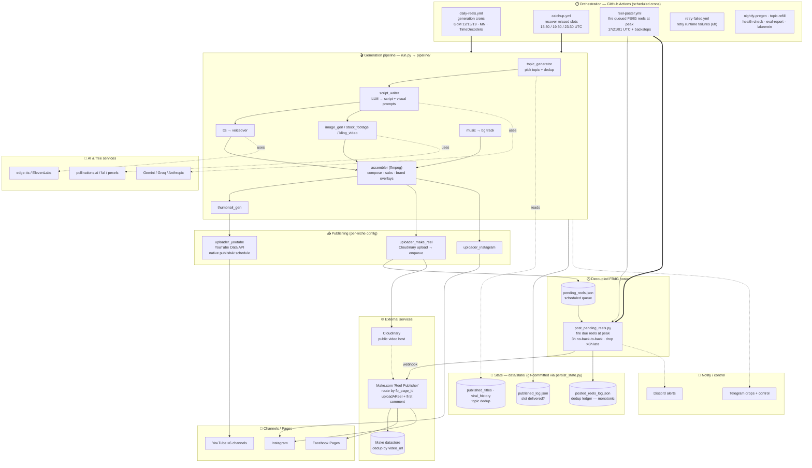

# Architecture — Multi-channel AI Short-Form Video Pipeline

Zero-dollar pipeline that generates vertical Shorts/Reels for 6 channels and
publishes them to **YouTube + Facebook + Instagram**, fully automated on free tiers.

**Channels:** KalyaanPath (bhakti/bhajan) · Itihaasvani (itihaas) · TimeDecoders
(ancient) · GodsOfTheMind (godmind) · Money Neurons (moneurons) · Lakeerein.

## Two publishing paths

| Path | How it schedules | Used by |
|------|------------------|---------|
| **YouTube** | `uploader_youtube` uploads private with a native `publishAt` → platform goes live at the exact peak. No queue. | all YT channels |
| **Facebook / Instagram** | `uploader_make_reel` uploads the mp4 to **Cloudinary** (public URL) and **queues** a record in `pending_reels.json`. `reel-poster.yml` runs `post_pending_reels.py` at each peak, which POSTs the **Make.com webhook**; the Make scenario routes by `fb_page_id` and posts the Reel + a first comment (promo link). | GoM, MN, TimeDecoders, KalyaanPath, Lakeerein |

## Reliability guarantees

- **No duplicates (G1):** `posted_reels_log.json` ledger (keyed by `video_url`, union-merged so it never loses an entry) + Make datastore dedup + `published_log.json` slot markers + topic recency.
- **No back-to-back (G2):** poster enforces a 3h per-page gap, ≤1 post/page/run; posts >6h past peak are dropped (no off-peak spam).
- **No missed slots (G3):** generation runs with a 5–6h buffer before peak; `catchup.yml` regenerates any dropped slot before its peak.
- **State survives races:** `persist_state.py` union-merges monotonic dedup files and retries the push.

## Cost stack (≈ $0/mo)

LLM = Gemini/Groq free · TTS = edge-tts · images = pollinations.ai/fal free
tiers · assembly = ffmpeg · scheduler = GitHub Actions · hosting = Cloudinary
free · FB/IG = Make.com free.

## Known constraints / risks

- **GitHub Actions minutes** (private repo = 2000 min/mo): heavy cron usage can
  exhaust them → whole pipeline (gen + posting) stops. Fix: make repo public
  (unlimited free) or set a spending limit.
- **`pending_reels.json` is a mutable file in git** → concurrent jobs can race
  on it. The ledger (monotonic) is the load-bearing dedup; the queue is
  best-effort. Permanent fix: move queue + ledger to an external KV store
  (Upstash Redis / Supabase) or use native FB scheduled-publish.
